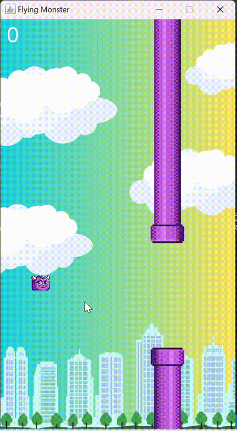

# Flying Monster

> A fun, interactive game where you guide a monster through obstacles! Inspired by the classic Flappy Bird, Flappy Monster provides a new twist and a unique challenge.

## About the Project

**Flying Monster** is a game developed in Java where players control a monster character, navigating it through pipes and avoiding obstacles. This project is designed to enhance understanding of game development concepts, including animation, collision detection, and event handling in Java.

## Below is the simulation for the Flying Monster game

## Features

- **Smooth animations** and responsive controls.
- **Randomly generated obstacles** for unique gameplay each time.
- **Score tracking** to challenge yourself and improve.
- **Fun graphics and sound effects** for an immersive experience.

## Gameplay

The objective is simple: guide the monster through the gaps in the pipes without hitting them. The game ends when the monster collides with a pipe or the ground. Try to survive as long as possible and score points by passing through the pipes!
